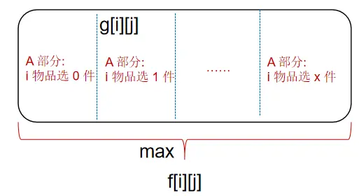
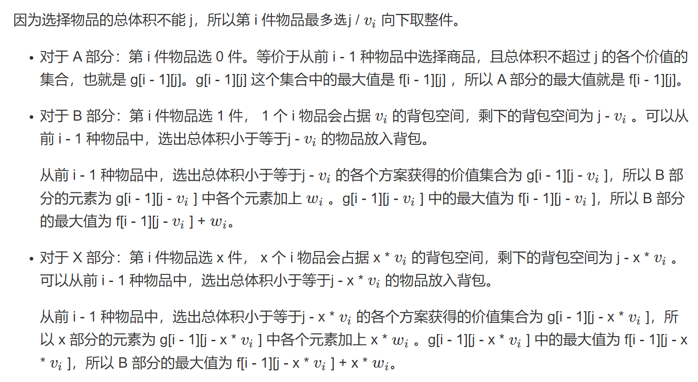
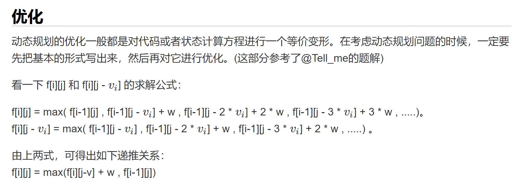
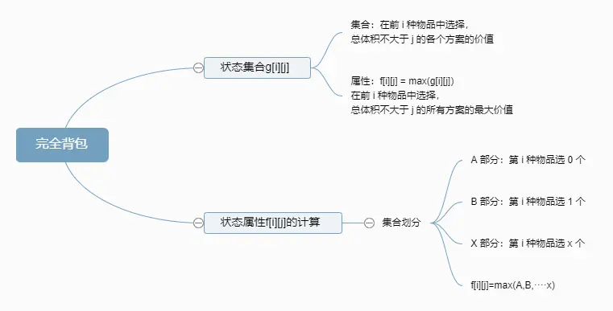

# 01背包问题
有 N件物品和一个容量是 V的背包。每件物品只能使用一次。
第 i件物品的体积是 vi，价值是 wi。

求解将哪些物品装入背包，可使这些物品的总体积不超过背包容量，且总价值最大。
输出最大价值。

输入格式
第一行两个整数，N，V，用空格隔开，分别表示物品数量和背包容积。

接下来有 N行，每行两个整数 vi,wi，用空格隔开，分别表示第 i件物品的体积和价值。

输出格式
输出一个整数，表示最大价值。

数据范围
0<N,V≤1000

0<vi,wi≤1000
输入样例
4 5
1 2
2 4
3 4
4 5
输出样例：
8

```cpp
#include<iostream>
using namespace std;

const int N=1010;
int f[N][N];//表示在前i个物品，体积不超过j，最大价值
int w[N];//表示第i件物品的价值
int v[N];//表示第i件物品的体积
int n,ve;//表示物品件数和体积

int main(){
    cin>>n>>ve;
    for(int i=1;i<=n;i++){
            cin>>v[i]>>w[i];
    }

    for(int i=1;i<=n;i++){
        for(int j=0;j<=ve;j++){
            f[i][j]=f[i-1][j];
            if(j>=v[i]){
                f[i][j]=max(f[i][j],f[i-1][j-v[i]]+w[i]);
            }
        }
    }
    cout<<f[n][ve]<<endl;
    return 0;
}
```


# 3. 完全背包问题

有 N种物品和一个容量是 V的背包，每种物品都有无限件可用。

第 i种物品的体积是 vi，价值是 wi。

求解将哪些物品装入背包，可使这些物品的总体积不超过背包容量，且总价值最大。输出最大价值。

输入格式
第一行两个整数，N，V，用空格隔开，分别表示物品种数和背包容积。
接下来有 N 行，每行两个整数 vi,wi，用空格隔开，分别表示第 i种物品的体积和价值。

输出格式
输出一个整数，表示最大价值。

数据范围
0<N,V≤1000

0<vi,wi≤1000
输入样例
4 5
1 2
2 4
3 4
4 5
输出样例：
10


01 背包根据是否选择第 i 件物品，也就是第 i 件物品选 0 个还是 1 个，把 g[i][j] 划分成了 A B 两部分，分别求出这两个部分的最大值，然后两者取最大值就是整体 g[i][j] 的最大值，也就求出了 f[i][j]。

完全背包问题也是根据第 i 件物品的选择数量，把 g[i][j] 划分成不同的部分，分别求出各个部分的最大值，取各个部分最大值中的最大值，就是整体 g[i][j] 的最大值，也就求出了 f[i][j]。




优化前
```cpp
#include<iostream>
using namespace std;

const int N = 1010;

int n, m;
int f[N][N], v[N], w[N];

int main(){
    cin >> n >> m;
    for(int i = 1; i <= n; i ++ )
        cin >> v[i] >> w[i];
    for(int i = 0; i <= m; i++)//初始化
    {
        f[0][i] = 0;
    }
    for(int i = 1; i <= n; i ++ )
        for(int j = 0; j <= m; j ++ )
            for(int k = 0; k * v[i] <= j; k ++ )
                f[i][j] = max(f[i][j], f[i - 1][j - k * v[i]] + k * w[i]);//求出每一个 f[i][j]
    cout << f[n][m] << endl;
}
```

```cpp
f[i][j] = max(f[i][j],f[i-1][j-v[i]]+w[i]);//01背包

f[i][j] = max(f[i][j],f[i][j-v[i]]+w[i]);//完全背包问题

//0 1 背包代码优化这里有详细说明
```


优化后
```cpp
#include<iostream>
using namespace std;

const int N = 1010;

int n, m;
int f[N][N], v[N], w[N];

int main()
{
    cin >> n >> m;
    for(int i = 1; i <= n; i ++ )
        cin >> v[i] >> w[i];
    for(int i = 1; i <= n; i ++ )
    {
        for(int j = 0; j <= m; j ++ )
        {
            if(v[i] <= j)
                f[i][j] =max(f[i - 1][j], f[i][j - v[i]] + w[i]);
            else
                f[i][j] = f[i - 1][j];
        }
    }
    cout << f[n][m] << endl;
}

```


# [4. 多重背包问题 I](https://www.acwing.com/problem/content/4/)


有 N种物品和一个容量是 V的背包。

第 i种物品最多有 si件，每件体积是 vi，价值是 wi。

求解将哪些物品装入背包，可使物品体积总和不超过背包容量，且价值总和最大。
输出最大价值。

输入格式
第一行两个整数，N，V，用空格隔开，分别表示物品种数和背包容积。

接下来有 N 行，每行三个整数 vi,wi,si，用空格隔开，分别表示第 i 种物品的体积、价值和数量。

输出格式
输出一个整数，表示最大价值。

数据范围
0<N,V≤100

0<vi,wi,si≤100
输入样例
4 5
1 2 3
2 4 1
3 4 3
4 5 2
输出样例：
10

```cpp
#include <iostream>
#include <cstring>
#include <algorithm>
using namespace std;

const int N = 110;
int f[N][N];
int v[N],w[N],s[N];

int main()
{
    int n,m;
    cin>>n>>m;
    for(int i=1;i<=n;i++){
        cin>>v[i]>>w[i]>>s[i];
    }
    
    for(int i=1;i<=n;i++){
        for(int j=1;j<=m;j++){
            for(int k=0;k<=s[i];k++){
                if(j>=k*v[i]){
                    f[i][j]=max(f[i][j],f[i-1][j-k*v[i]]+k*w[i]);
                }

            }
        }
    }
    cout<<f[n][m]<<endl;
    return 0;
}
```

# [5. 多重背包问题 II](https://www.acwing.com/problem/content/5/)
有 N 种物品和一个容量是 V 的背包。

第 i 种物品最多有 si 件，每件体积是 vi，价值是 wi。

求解将哪些物品装入背包，可使物品体积总和不超过背包容量，且价值总和最大。
输出最大价值。

输入格式
第一行两个整数，N，V
，用空格隔开，分别表示物品种数和背包容积。

接下来有 N
 行，每行三个整数 vi,wi,si
，用空格隔开，分别表示第 i
 种物品的体积、价值和数量。

输出格式
输出一个整数，表示最大价值。

数据范围
0<N≤1000

0<V≤2000

0<vi,wi,si≤2000
提示：
本题考查多重背包的二进制优化方法。

输入样例
4 5
1 2 3
2 4 1
3 4 3
4 5 2
输出样例：
10


```cpp
#include<iostream>
using namespace std;

const int N = 12010, M = 2010;

int n, m;
int v[N], w[N]; //逐一枚举最大是N*logS
int f[M]; // 体积<M

int main()
{
    cin >> n >> m;
    int cnt = 0; //分组的组别
    for(int i = 1;i <= n;i ++)
    {
        int a,b,s;
        cin >> a >> b >> s;
        int k = 1; // 组别里面的个数
        while(k<=s)
        {
            cnt ++ ; //组别先增加
            v[cnt] = a * k ; //整体体积
            w[cnt] = b * k; // 整体价值
            s -= k; // s要减小
            k *= 2; // 组别里的个数增加
        }
        //剩余的一组
        if(s>0)
        {
            cnt ++ ;
            v[cnt] = a*s; 
            w[cnt] = b*s;
        }
    }

    n = cnt ; //枚举次数正式由个数变成组别数

    //01背包一维优化
    for(int i = 1;i <= n ;i ++)
        for(int j = m ;j >= v[i];j --)
            f[j] = max(f[j],f[j-v[i]] + w[i]);

    cout << f[m] << endl;
    return 0;
}


```