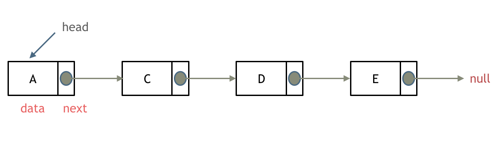
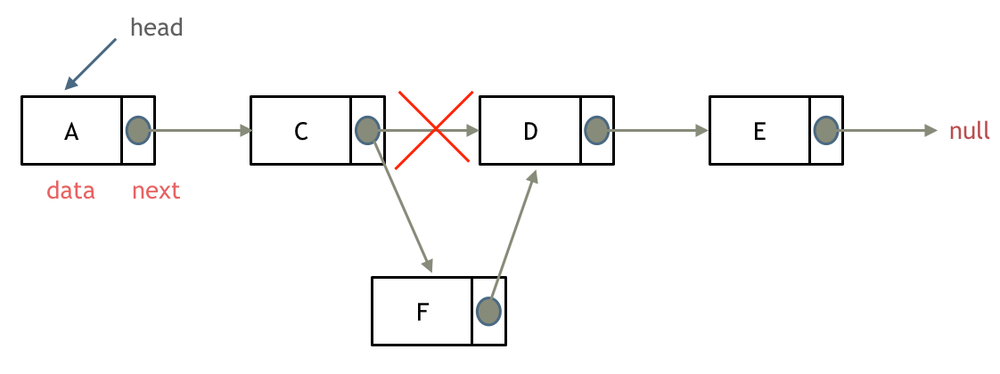

# 什么是链表
链表是一种通过指针串联在一起的线性结构，每一个节点由两部分组成，一个是数据域一个是指针域（存放指向下一个节点的指针），最后一个节点的指针域指向null（空指针的意思）。

链表的入口节点称为链表的头结点也就是head。



# 链表的类型

## 单链表
一个节点只有一个指针的就是单链表
```cpp
class Listnode{
private:
    int val;
    Listnode* next;
public:
    Listnode(int x):val(x),next(NULL){}
};
```


## 双链表
双链表：每一个节点有两个指针域，一个指向下一个节点，一个指向上一个节点。

双链表 既可以向前查询也可以向后查询。

## 循环链表
循环链表，顾名思义，就是链表首尾相连。

# 链表操作
## 删除节点

只要将C节点的next指针 指向E节点就可以了。
D节点是依然存留在内存里的
在C++里最好是再手动释放这个D节点，释放这块内存。
其他语言例如Java、Python，就有自己的内存回收机制，就不用自己手动释放了。

## 添加节点

如图所示